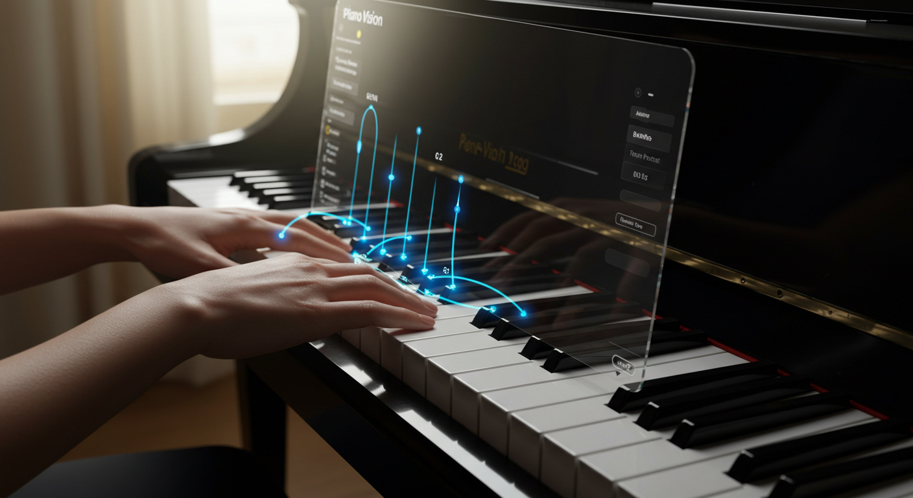

<p align="center">
    
</p>

---

PianoVisionFingering is a tool that uses LLM to generate piano fingering 
for VR game [PianoVision](https://www.meta.com/experiences/pianovision/5271074762922599/).


## Usage

This project was a failed exploration into using large language models to generate PianoVision piano fingerings.

In main.go, import your MIDI file and run file, ```err := os.ReadFile("assets/4007468864.mid")```.

The console will eventually print an output similar to this: ```{"Right":[{"ts":[4,4],"notes":[{"n":"D7","f":0},{"n":"E7","f":0},{"n":"C7","f":0}.......```

Send this output to an LLM and ask how to play it, assigning the suggested fingerings to the f field (where 1-5 represent the fingers from thumb to pinky). Save the LLM's output as JSON to ```assets/input.json```.

Run this program again, and it will output ```output.json``` containing the fingerings. This JSON can then be imported into PianoVision for playback.

The final result showed significant errors in the generated fingerings and caused some measures to be lost, rendering the output completely unusable. The project will be restarted in the future when an LLM specializing in music becomes available.

**If you have any other ideas, please feel free to contact me  : )**

## License

MIT
